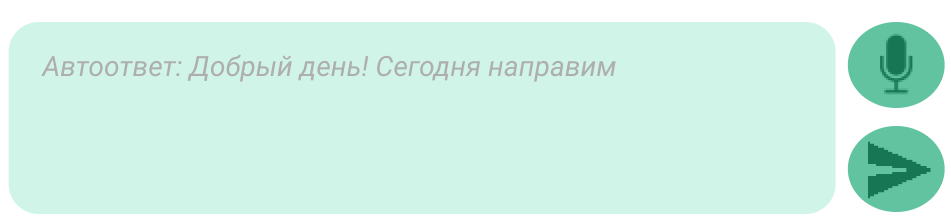

## Команда НеИИ. Кейс СБЕР

Решение состоит из следующих компонентов:

1. Почтовый клиент.
  
2. Mail Rest Service.
  - Подключается к почтовому ящику по протоколу IMAP.:heavy_check_mark:
  - Отправляет непрочитанные в NLP и NLG сервисы.
  - Получает от сервисов ответ и передает информацию на клиент.
3. NLP сервис.
  - Определение темы письма. На клиенте письма раскидываются по папкам в зависимости от темы.
  - Реферирование текста. На клиенте вместо неинформативных преамбул типа "Добрый день, коллеги..." отображается суть письма в 1-2 фразах. Позволяет видеть суть без "проваливания" в каждую цепочку.
  - Определение важности. На клиенте письма, определенный как важные, отмечаются значком :fire:
4. NLG сервис.
  - Генерация возможного ответа. На клиенте выводится в диалоговом окне цепочки в качестве подсказки серым шрифтом. Отправка только по нажатию пользователя.
  
5. Голосовой помощник
  Система состоит из следующих компонентов
  - asr_service - Сервис распознавания речи для голосового управления: набор ответа, голосовой поиск. [Подробнее](https://github.com/maya-ami/neii_hackathon2020/tree/master/voice_assistant/asr_service)

  - nlu_service - Сервис выделения интентов пользователя. [Подробнее](https://github.com/maya-ami/neii_hackathon2020/tree/master/voice_assistant/nlu_service)

  - tts_service - Сервис синтеза речи для . [Подробнее](https://github.com/maya-amineii_hackathon2020/tree/master/voice_assistant/tts_service)
