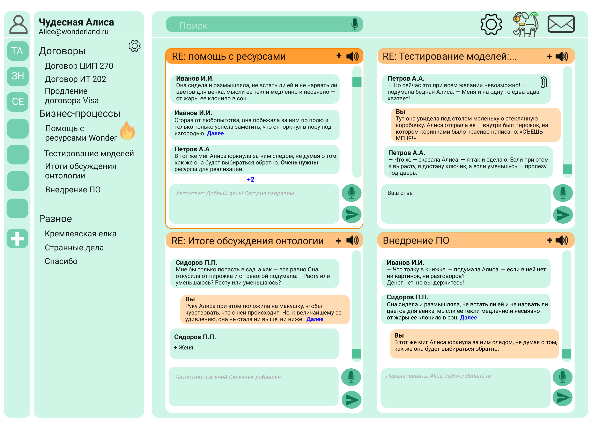

## Top-5 solution for a final round of a nation-wide hackathon ["Digital Breakthrough"](https://leadersofdigital.ru)

A system's architecture:

Details about each component:

1. **Concept of an email client.**
  
2. **Mail Rest Service.**
  - Connects to email via IMAP.:heavy_check_mark:
  - Sends unread mails to NLP and NLG services and receives answers.:heavy_check_mark:
  - Creates emails folders and sorts mails based on topics.:heavy_check_mark:
3. **NLP services.**
  - [topic](nlp_services/topic) - Text classification.:heavy_check_mark:
  - [summary](nlp_services/summary) - Text summarization. On the client-side, summary can be shown on hovering over a mail.:heavy_check_mark:
4. **NLG service.**
  - Generates a possible answer. On the client-side, a suggested reply can be shown in gray. **UNDER DEVELOPMENT**
  
5. **Voice assistant.**

  VA consists of the following components:
  - [asr_service](voice_assistant/asr_service) - Speech recognition for voice control: voice typing emails, voice search, etc.:heavy_check_mark:

  - nlu_service - An intent classification service. **UNDER DEVELOPMENT**

  - [tts_service](voice_assistant/tts_service) - Text-to-speech synthesis saves time for reading emails for you.:heavy_check_mark:
