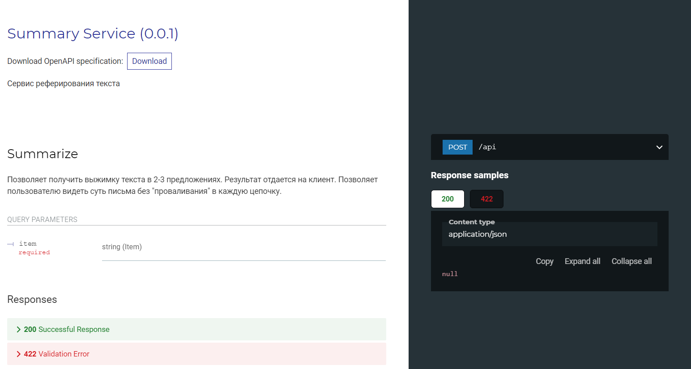

## Сервис реферирования текста

Позволяет получить выжимку текста в 2-3 предложениях. Результат отдается на клиент. Позволяет пользователю видеть суть письма без "проваливания" в каждую цепочку.

## Запуск
```
cd ..
uvicorn --host HOST --port PORT summary:app
```

## Документация
Документация API доступна по адресу http://HOST:PORT/redoc


