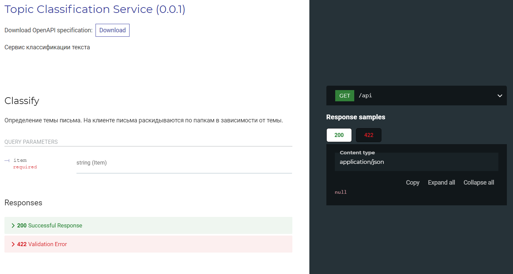

## Сервис классификации писем
На клиенте письма раскидываются по папкам в зависимости от темы.

**NB**: в прототипе используется модель определения тональности текста. В проде заменить на релевантную модель классификации.

## Запуск
```
uvicorn --host HOST --port PORT src:app
```

## Документация
Документация API доступна по адресу http://HOST:PORT/redoc


