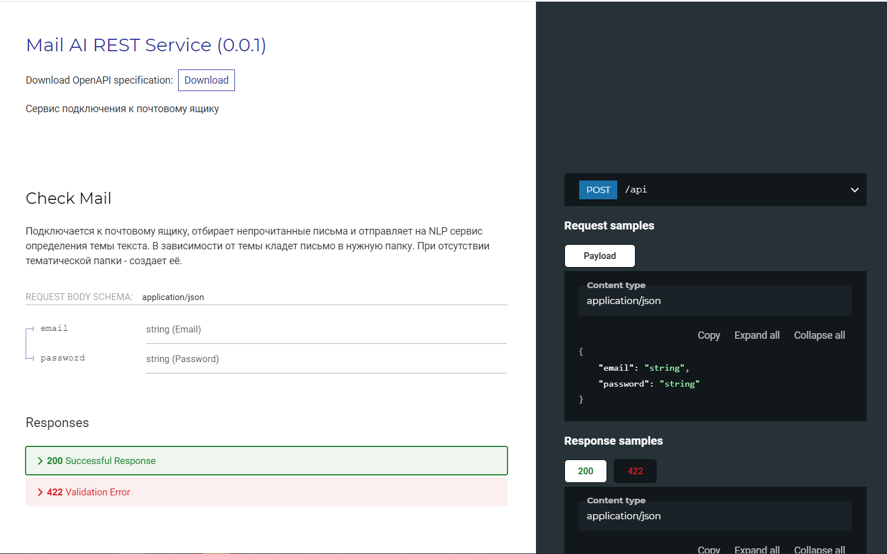

## Mail Rest Service.
- Подключается к почтовому ящику по протоколу IMAP.:heavy_check_mark:
- Отправляет непрочитанные в NLP и NLG сервисы.:heavy_check_mark:
- Получает от сервисов ответ и передает информацию на клиент.:heavy_check_mark:

## Запуск
```
uvicorn --host HOST --port PORT src:app
```

## Документация
Документация API доступна по адресу http://HOST:PORT/redoc


